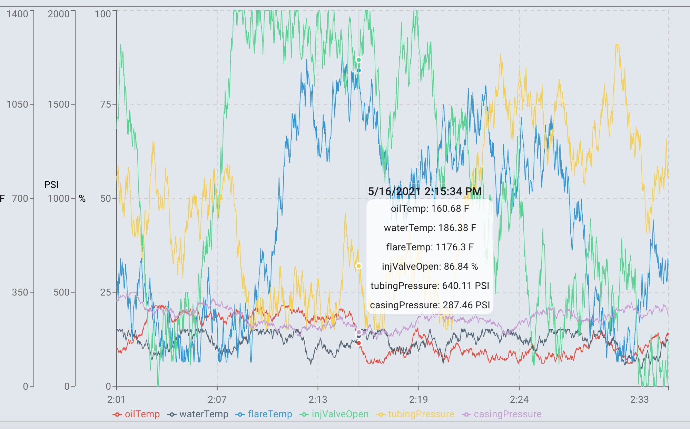

# EOG React Visualization


## Description 
This project was built as part of the [EOG React Visualization Assessment](https://react.eogresources.com). The goal of the project was to create a dashboard that depicts live data in the form of graphs and metric readings. This dashboard would in turn be used by either engineers or managers of an oil refinery so they can make sure all the equipment is working properly. The data is provided by a graphQL api designed by EOG and simulates hypothetical set of equipment in the field (in this case, metric reading for an oil refinery). After the data is received, it is stored and manipulated on the front end using Redux.  

### View the Project Live <br>
https://employee-management-system-1.herokuapp.com/

#### Built With
* graphQL
* React.js
* Redux
* Bootstrap
* [Recharts](https://recharts.org/en-US/)

## Usage 

#### Metric Select

* Mulitselect that allows the user to decide which metric data they want to track.   


#### Metric Cards

* Has the current reading of different metric data.  Will be displayed if the metric data is selected in the multiselect above.   


#### Live Graphs
 
* Displays the past 30 minutes of data along with updated readings since the application began running.   



## Installation

### Run the Project Locally

* Step 1: Navigate to the directory you want to store the project. Clone this your repository to your local computer using the command below. 
```bash
git clone https://github.com/Mark-Mulligan/eog-react-assessment-v2.0.git
```

* Step 2: Use the command line to navigate to the directory that you cloned the project.
Example:
```bash
cd directory/projectdirectory
```

* Step 3: Install the npm package dependencies from the package.json file.
```bash
yarn install
```

* Step 4: Making sure you are in the root directory of the project, start the project using yarn start.  The project should now be running on localhost:3000 .
```bash
yarn start
```

## Questions
[My Github](https://github.com/Mark-Mulligan) || mark.mulligan.jr1@gmail.com

#### How to Contact Me
Feel free to reach out to me if you have any questions about this project.  You can email me using the email listed above or can go to my github page to view my other projects and portfolio.

© Mark Mulligan 2021 All Rights Reserved.